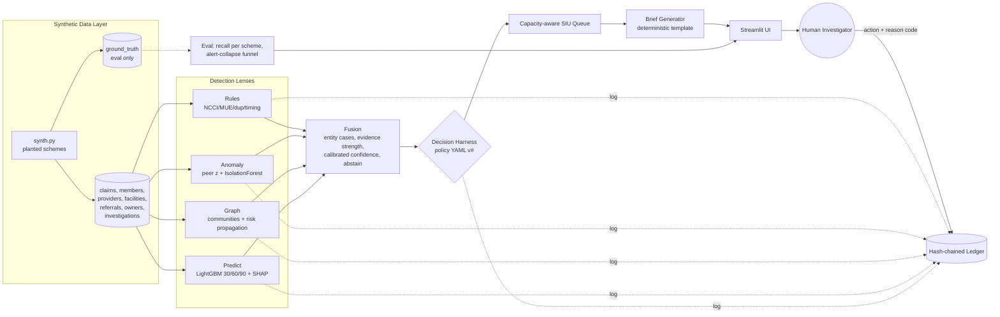
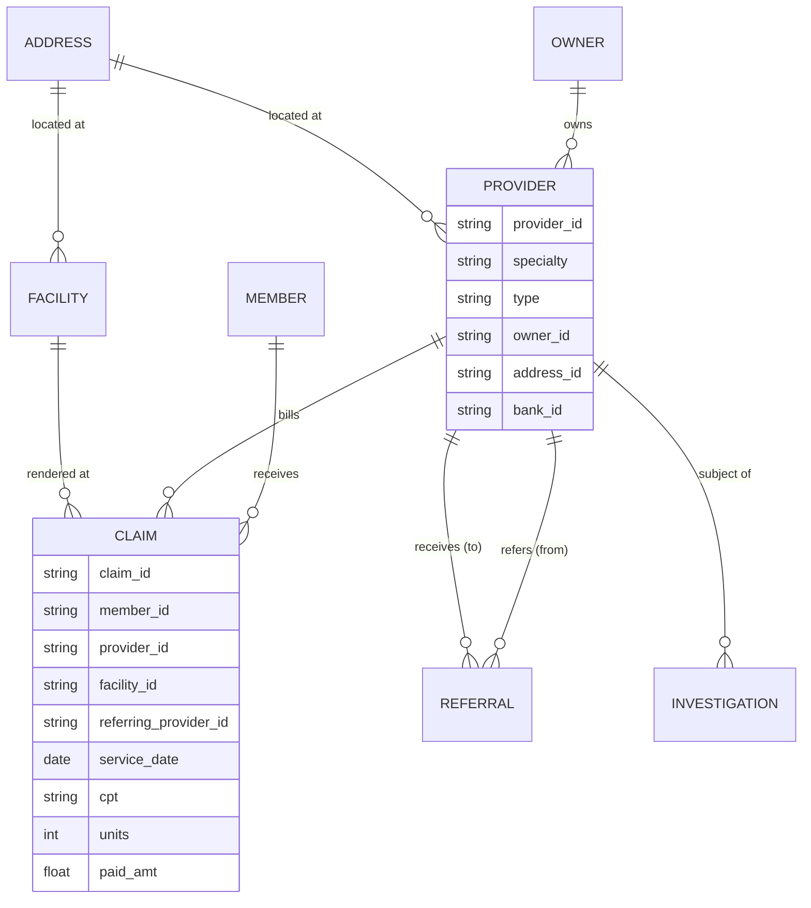
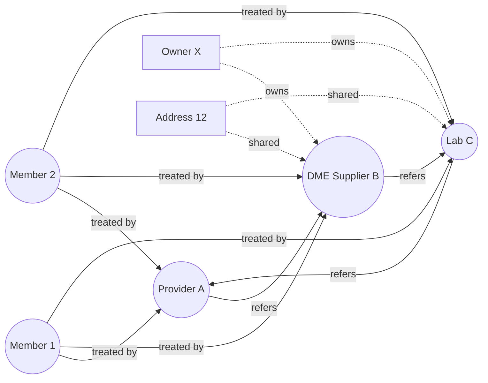
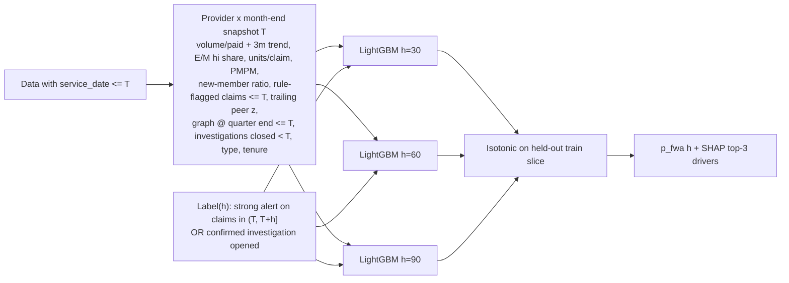
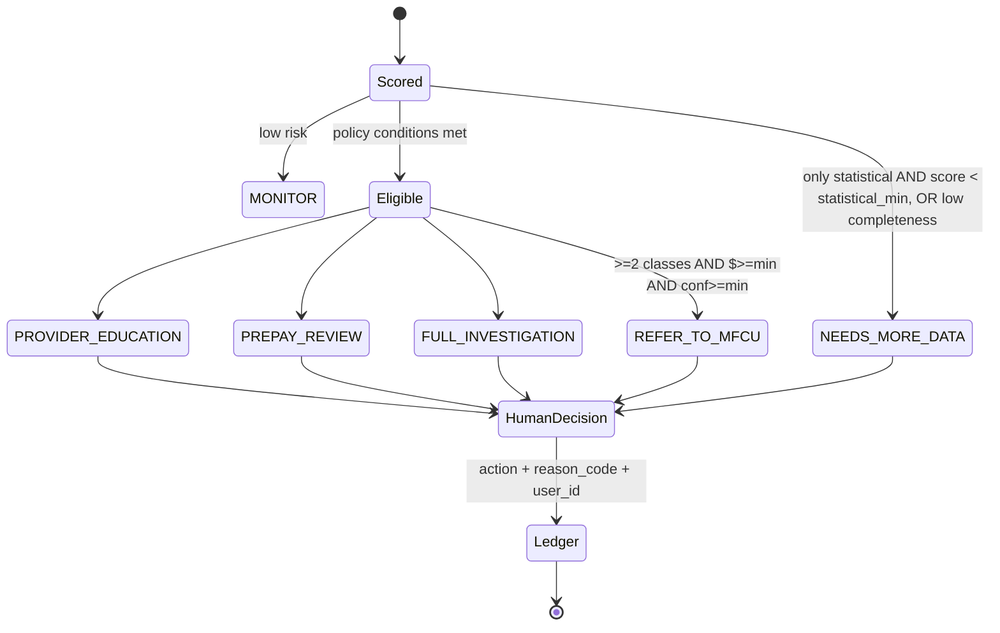
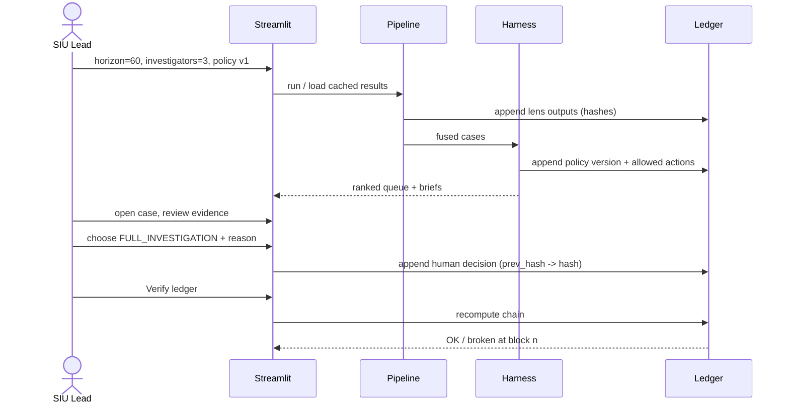

# ClaimShield Nexus — Architecture

## 1. User journey
**Input:** SIU lead selects data snapshot, horizon (30/60/90), investigator capacity, and policy version.
**System:** runs 4 lenses → fuses evidence → applies human-authored harness → ranks by capacity.
**Output:** ranked cases, each with an evidence-cited brief, confidence, limitations and allowed actions.
**Uncertain:** case is routed to `NEEDS_MORE_DATA` with the missing evidence listed; it is never escalated automatically.
**Decision:** only a human picks the action; it is hash-chained into the ledger.

## 2. System overview


## 3. Data model


## 4. Graph model (lens 3)

Signals: Louvain community density, shared owner/address/bank, referral reciprocity & concentration, member overlap (Jaccard), personalized PageRank seeded from confirmed past investigations.

## 5. Prediction (lens 4)

- Snapshots from month 4 to the last T where T+h fits; latest snapshot (T = end of data) is scored for the queue.
- Strong alert = deterministic/structural score >= 0.6 or anomaly score >= 0.86. Rule flags are bucketed by service month (rules are not re-run per snapshot).
- Time split: fit T <= 2024-10, calibrate T in 2024-11..12, test T >= 2025-01. LightGBM num_threads=4, 300 trees, 15 leaves, seed 42. A `model_run` ledger block records params hash, ranges and metrics.
- Leakage guard: a test rebuilds features from data truncated at T0 and asserts identical rows for every T <= T0.
- The forecast is **not evidence**: it stays out of evidence classes and confidence, never counts for FULL_INVESTIGATION / REFER_TO_MFCU, and can only lift a strong statistical-only case to PREPAY_REVIEW (policy `predictive.lift_min`, `predictive.statistical_min`). It drives queue `p_fwa(h)`.

## 6. Decision harness & human-in-the-loop

Evidence classes: **deterministic** (rules), **structural** (graph), **statistical** (anomaly), **predictive** (P5; absent until then). Independence = distinct classes, not distinct alerts. Confidence = weighted noisy-OR of per-class max scores × data-completeness factor (no isotonic calibration until the predictive class lands in P5; 60 labels are too few). Abstain only when the case rests on statistical evidence alone below `abstain.statistical_min`, or data completeness is low; a strong single deterministic or structural signal may reach PREPAY_REVIEW / FULL_INVESTIGATION. MFCU always needs ≥ 2 classes + min $ + min confidence + a human.

Example policy (`policy/harness_v1.yaml`, abridged):
```yaml
version: 1
class_weights: {deterministic: 0.95, structural: 0.85, statistical: 0.55, predictive: 0.7}
abstain: {statistical_min: 0.75, min_completeness: 0.6}
actions:
  REFER_TO_MFCU:      {min_classes: 2, min_conf: 0.85, min_dollars: 25000, requires_human: true}
  FULL_INVESTIGATION: {min_conf: 0.75, min_dollars: 5000, any_of: [{min_classes: 2}, {classes_any: [structural], min_severity: 4}, {classes_any: [deterministic], min_severity: 4}]}
  PREPAY_REVIEW:      {min_conf: 0.55, classes_any: [deterministic, structural]}
  PROVIDER_EDUCATION: {classes_any: [deterministic, statistical], max_dollars: 5000}
weights: {severity: {1: 1, 3: 1.5, 5: 3}, member_harm: {bh: 2.0, home_health: 1.8, default: 1.0}}
capacity: {investigators: 3, hours_per_investigator_week: 30}
```

Queue: `priority = p_fwa(h) × $ at risk × severity_w × member_harm_w ÷ est_hours`. Must-take cases (policy `must_take`: REFER_TO_MFCU or severity ≥ 5) are filled first; a must-take case that doesn't fit is flagged `over_capacity` (escalate to SIU lead), never silently deferred. The rest fill greedily; overflow is `deferred`. Backlog = queued hours ÷ weekly capacity (weeks to clear).

## 7. Decision sequence


## 8. Audit ledger
Append-only SQLite table: `idx, ts, actor, event_type, payload_json, payload_sha, prev_hash, hash` where `hash = SHA256(prev_hash || payload_sha || ts || actor)`. `verify()` recomputes every hash and returns the first broken index. This gives tamper evidence without a blockchain and without exposing PHI.

## 9. Responsible AI
| Risk | Mitigation |
|---|---|
| False accusation | No auto-action; abstain band; ≥2 independent lenses for escalation; legit outliers in test data |
| Opaque scores | Evidence rows with field/value/expected; SHAP drivers; rule IDs |
| Bias by specialty/region | Peer groups per specialty+type; report flag rates by group on Overview |
| Silent policy change | Policy versions hashed into ledger |
| Data gaps | Completeness check lowers confidence, adds to limitations |
| Model drift | Time-split eval; precision tracked from investigator verdicts |
