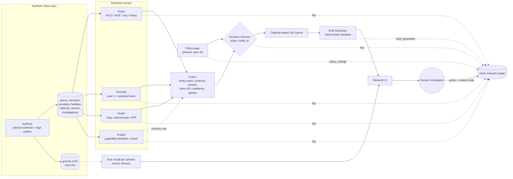
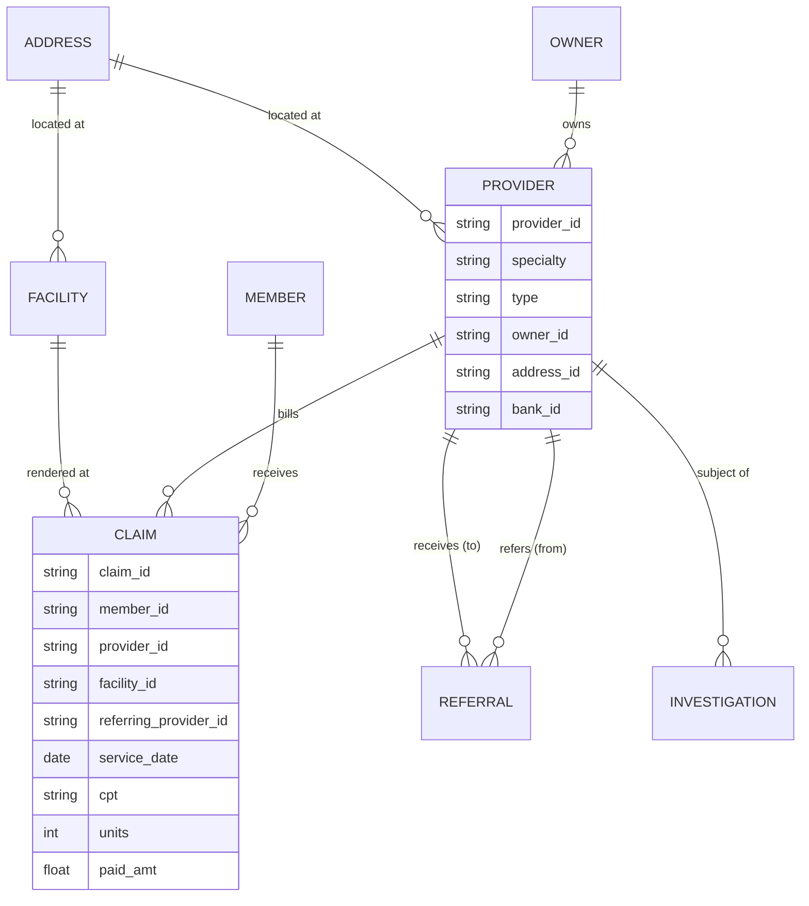
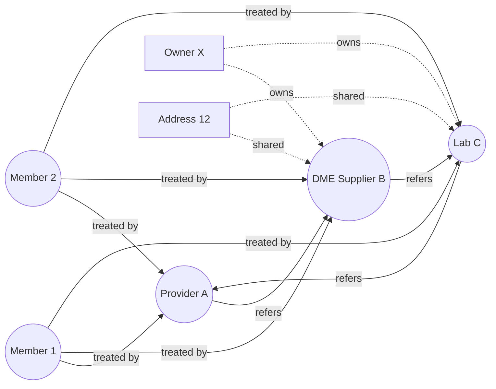
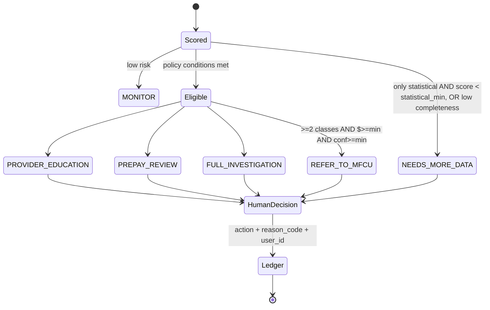
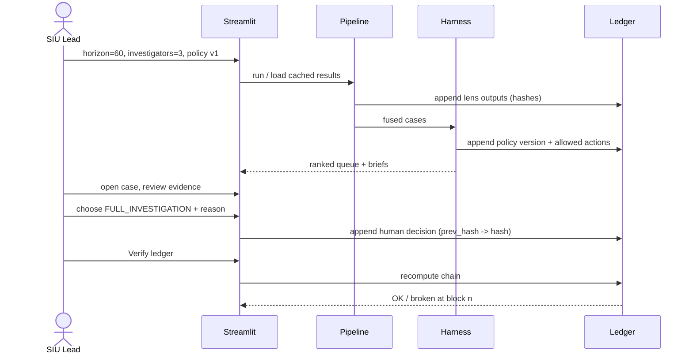
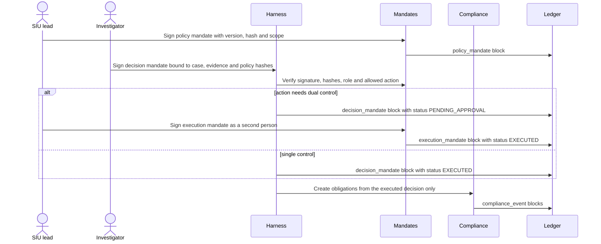
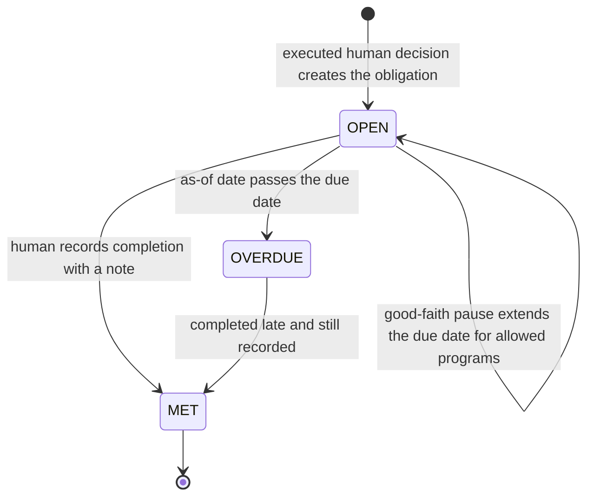

# ClaimShield Nexus — Architecture

## 1. User journey
**Input:** SIU lead selects data snapshot, horizon (30/60/90), investigator capacity, and policy version.
**System:** runs 4 lenses → fuses evidence → applies human-authored harness → ranks by capacity.
**Output:** ranked cases, each with an evidence-cited brief, confidence, limitations and allowed actions.
**Uncertain:** case is routed to `NEEDS_MORE_DATA` with the missing evidence listed; it is never escalated automatically.
**Decision:** only a human picks the action; it is hash-chained into the ledger.

## 2. System overview


## 3. Data model


## 4. Graph model (lens 3)

Signals: Louvain community density, shared owner/address/bank, referral reciprocity & concentration, member overlap (Jaccard), personalized PageRank seeded from confirmed past investigations.

## 5. Prediction (lens 4)

- Snapshots from month 4 to the last T where T+h fits; latest snapshot (T = end of data) is scored for the queue.
- Strong alert = deterministic/structural score >= 0.6 or anomaly score >= 0.86. Rule flags are bucketed by service month (rules are not re-run per snapshot).
- Time split with embargo: test T >= 2025-01-31; fit/calibration rows are kept only if T + h <= the next split's first T (calibration = last 2 eligible months), so no training label sees events in a later split. Per horizon: h=30 fit <= 2024-10, cal 2024-11..12; h=60 fit <= 2024-08, cal 2024-10..11; h=90 fit <= 2024-06, cal 2024-09..10. LightGBM num_threads=4, 300 trees, 15 leaves, seed 42. A `model_run` ledger block records params hash, ranges and metrics.
- Leakage guard: a test rebuilds features from data truncated at T0 and asserts identical rows for every T <= T0.
- **Positioning:** "The predictive lens is an early warning for providers WITHOUT flag history (new-onset). On already-flagged providers a naive persistence baseline is as good or better; we show both."
- Known label limitation: strong-alert labels use whole-run alert scores (not re-scored per snapshot), so labels carry mild hindsight.
- The forecast is **not evidence**: it stays out of evidence classes and confidence, never counts for FULL_INVESTIGATION / REFER_TO_MFCU, and can only lift a strong statistical-only case to PREPAY_REVIEW (policy `predictive.lift_min`, `predictive.statistical_min`). It drives queue `p_fwa(h)`.

## 6. Decision harness & human-in-the-loop

Evidence classes: **deterministic** (rules), **structural** (graph), **statistical** (anomaly); the **predictive** forecast (P5) is kept out of the classes. Independence = distinct classes, not distinct alerts. Confidence = weighted noisy-OR of per-class max scores × data-completeness factor (no isotonic calibration: 60 past investigations are too few labels; the predictive forecast is calibrated separately and stays out of confidence). Abstain only when the case rests on statistical evidence alone below `abstain.statistical_min`, or data completeness is low; a strong single deterministic or structural signal may reach PREPAY_REVIEW / FULL_INVESTIGATION. MFCU always needs ≥ 2 classes + min $ + min confidence + a human.

Example policy (`policy/harness_v1.yaml`, abridged; values as shipped):
```yaml
version: 1
class_weights: {deterministic: 0.95, structural: 0.9, statistical: 0.7, predictive: 0.7}
abstain: {statistical_min: 0.6, min_completeness: 0.6}
predictive: {lift_min: 0.7, statistical_min: 0.75}
actions:
  REFER_TO_MFCU:      {requires_human: true, min_classes: 2, min_conf: 0.85, min_dollars: 25000, min_severity: 4}
  FULL_INVESTIGATION: {min_conf: 0.7, any_of: [{min_classes: 2, min_dollars: 5000}, {classes_any: [structural], min_severity: 4, min_dollars: 5000}, {classes_any: [deterministic], min_severity: 4, min_dollars: 5000}, {classes_any: [deterministic], min_severity: 5}]}
  PREPAY_REVIEW:      {any_of: [{classes_any: [deterministic, structural], min_conf: 0.55}, {codes_any: ["AN:em_hi_share"], min_class_score: {statistical: 0.85}, min_conf: 0.55}, {predictive_lift: true}]}
  PROVIDER_EDUCATION: {max_dollars: 5000, max_severity: 3, codes_any: [R01, R02, R03, "AN:em_hi_share", "AN:units_per_claim"]}
est_hours: {PROVIDER_EDUCATION: 2, PREPAY_REVIEW: 6, FULL_INVESTIGATION: 16, REFER_TO_MFCU: 12, per_extra_provider: 2}
must_take: {actions: [REFER_TO_MFCU], min_severity: 5}
capacity: {investigators: 3, hours_per_investigator_week: 30}
```
Every policy is validated on load, preview and save (probabilities in [0, 1], non-negative dollars and hours, all actions present). Humans change thresholds on the Policy page: the preview is in memory only; saving writes the next `harness_vN.yaml` (never overwriting) and a `policy_change` ledger block (old hash → new hash, author, reason).

Queue: `priority = p_fwa(h) × $ at risk × severity_w × member_harm_w ÷ est_hours`. Must-take cases (policy `must_take`: REFER_TO_MFCU or severity ≥ 5) are filled first; a must-take case that doesn't fit is flagged `over_capacity` (escalate to SIU lead), never silently deferred. The rest fill greedily; overflow is `deferred`. Backlog = queued hours ÷ weekly capacity (weeks to clear).

## 7. Decision sequence


## 8. Audit ledger
Append-only SQLite table: `idx, ts, actor, event_type, payload_json, payload_sha, prev_hash, hash` where `hash = SHA256(prev_hash || payload_sha || ts || actor || event_type)`. Writers are serialised (`BEGIN IMMEDIATE`), so concurrent sessions never collide or fork the chain. Blocks: `lens_run`, `model_run`, `fusion_run` (policy hash + Merkle root over case hashes), `policy_change`, `brief_generated` (brief sha256; the brief cites its own block index) and `human_decision`. `verify()` recomputes every hash and returns the first broken index. This gives tamper evidence without a blockchain and without storing PHI or claim lines.

## 9. Responsible AI
| Risk | Mitigation |
|---|---|
| False accusation | No auto-action; abstain band; ≥2 independent lenses for escalation; legit outliers in test data |
| Opaque scores | Evidence rows with field/value/expected; SHAP drivers; rule IDs |
| Bias by specialty/region | Peer groups per specialty+type; report flag rates by group on Overview |
| Silent policy change | Policy versions hashed into ledger |
| Data gaps | Completeness check lowers confidence, adds to limitations |
| Model drift | Time-split eval; precision tracked from investigator verdicts |

## 10. Signed mandates (AP2-inspired)
Agent-payment mandates (signed intent, signed cart, default-deny automation, tamper-evident logs) applied to enforcement: the policy is the **intent mandate** signed by an SIU lead, each decision is a **decision mandate** signed by the investigator and bound to the case, evidence and policy hashes, and high-impact actions need an **execution mandate**, a second signature by a different SIU lead. Mandates are canonical JSON (sorted keys, no whitespace) → SHA-256 → Ed25519 signature; each is stored with its signature and key fingerprint in a ledger block. Production would hold keys in an HSM/KMS behind SSO identities.



Fail safe: a missing, invalid or revoked policy mandate makes `decide()` refuse every action; the system actor may only route MONITOR / NEEDS_MORE_DATA; an approver must be an SIU lead other than the decision signer; a revoked decision cannot be approved.

## 11. Compliance obligations
Obligations are created only from executed human decisions (never from scores): REFER_TO_MFCU creates a payment-suspension determination (SUSPEND or GOOD_CAUSE with documented reason), a written MFCU referral due the next business day (weekends skipped; federal holidays out of scope) and an MFCU certification every 90 days while open; an OVERPAYMENT_IDENTIFIED decision starts a 60-day return clock, pausable up to 180 days only for programs the policy allows (Medicare A/B). Status is computed against an injectable `asof` date. Citations: docs/COMPLIANCE.md.


