# ClaimShield Nexus - Machines fins evidence. Humans make decisions. Ledgers prove it

<div align="center">
  
</div>

<div align="center">
Machines find evidence. Humans make decisions. The ledger proves it.

**Team Aurora** — Aryan Gupta


</div>

| Layer | Technology |
|---|---|
| Data | pandas, NumPy, Parquet (PyArrow); seeded synthetic generator with planted schemes |
| Detection | Deterministic claim edits in pandas; peer-group robust z-scores and IsolationForest (scikit-learn) |
| Prediction | LightGBM per horizon (30/60/90 days), isotonic calibration, SHAP TreeExplainer drivers |
| Graph | NetworkX entity graph, Louvain communities, personalized PageRank; PyVis ego networks |
| Decision harness | Human-authored YAML policy (PyYAML), versioned and hashed |
| Audit ledger | SQLite, append-only SHA-256 hash chain (Python standard library) |
| Signed mandates | Ed25519 signatures (`cryptography`) on policy, decision and approval mandates |
| UI | Streamlit multipage app, Plotly charts |
| Testing | pytest, Streamlit AppTest, fresh-clone end-to-end check |


## Overview

Medicaid program-integrity teams get far more fraud, waste and abuse (FWA) signals than their Special Investigations Unit (SIU) can work, and most come as unexplained scores or thousands of raw claim-line flags. ClaimShield Nexus turns claims into a short, capacity-ranked list of cases. Each case comes with cited evidence, an honest confidence, its limitations and the actions a human-authored policy allows. Models only propose: the final action is always a recorded human decision, and every step lands in a tamper-evident ledger. Built for the Acentra Health healthcare-payer FWA challenge, using **synthetic data only** (no PHI, fixed seed).

## Highlights

- **Four detection lenses.** Deterministic rules, peer-group statistics, an entity graph and a 30/60/90-day forecast each look at the claims differently.
- **Evidence-class fusion.** Alerts collapse into provider or ring cases. Independence is counted by evidence class (deterministic, structural, statistical), not by alert count, and the forecast never counts as evidence.
- **Human-authored policy harness.** A versioned YAML policy decides which actions are allowed. Weak or thin evidence abstains to `NEEDS_MORE_DATA`, and `REFER_TO_MFCU` needs two evidence classes, minimum dollars and confidence, plus a human.
- **Capacity-aware SIU queue.** `priority = P(escalation) × $ at risk × severity × member harm ÷ est. hours`, filled against real investigator hours. Must-take cases go first, and overflow is shown, never dropped.
- **Explainable investigation briefs.** A deterministic 14-section brief (evidence table, timeline, network, forecast drivers, limitations, regulatory basis, authorisation chain) downloads as Markdown or print-ready HTML.
- **Signed, tamper-evident decisions.** Policies, decisions and approvals are Ed25519-signed mandates; high-impact actions need a second signature; everything is hash-chained, and tampering fails both chain and signature checks at the same block.

## Screenshots

Light and dark themes: the app follows the visitor's system setting, and the **Light / Dark** toggle at the top of the sidebar overrides it (kept in the URL across pages and refreshes). Body text meets WCAG AA contrast in both themes (enforced by `tests/test_contrast.py`).

<table>
  <tr>
    <td width="50%">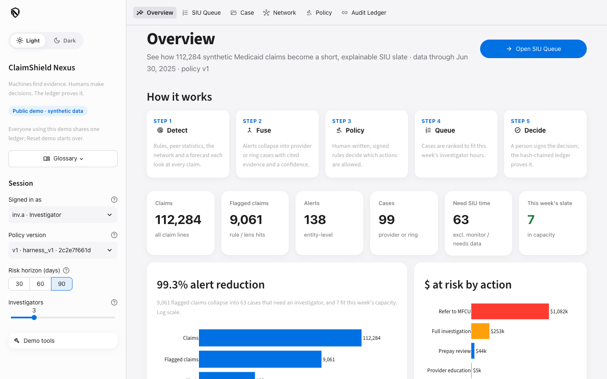<br><sub><b>Overview</b> — 9,061 flagged claims collapse into 63 cases needing investigator time; 7 fit this week.</sub></td>
    <td width="50%">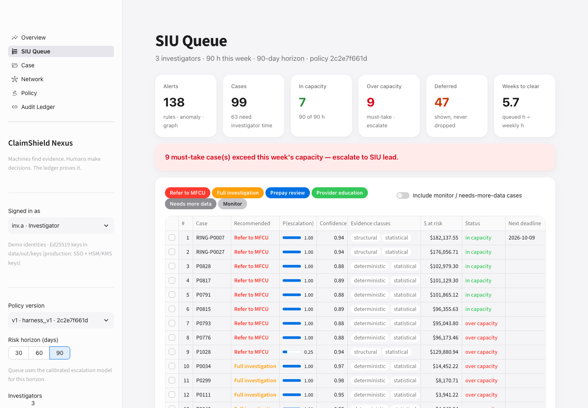<br><sub><b>SIU Queue</b> — capacity-ranked slate with next compliance deadline; must-take cases first.</sub></td>
  </tr>
  <tr>
    <td>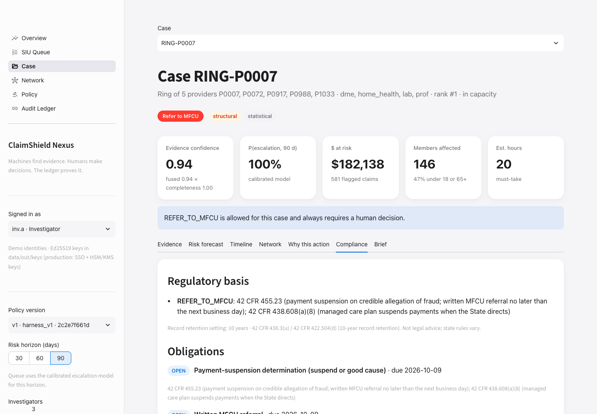<br><sub><b>Ring case, Compliance tab</b> — regulatory basis and the obligations created by a dual-signed MFCU referral.</sub></td>
    <td>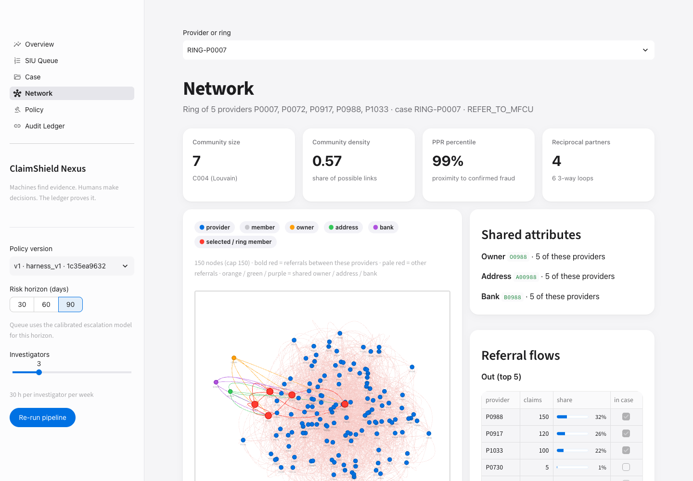<br><sub><b>Network</b> — ring members in red, referral loops in bold red, shared owner/address/bank links.</sub></td>
  </tr>
  <tr>
    <td>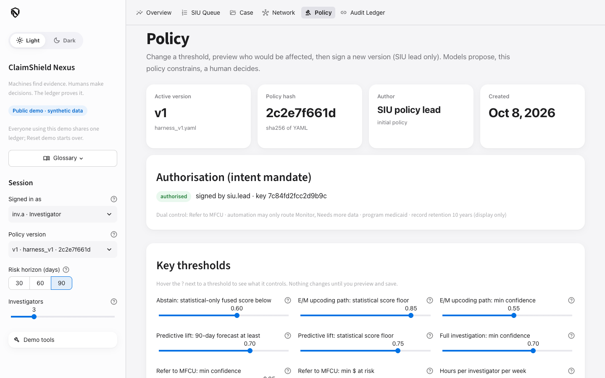<br><sub><b>Policy</b> — humans edit thresholds, preview the impact, then save a new hashed version.</sub></td>
    <td>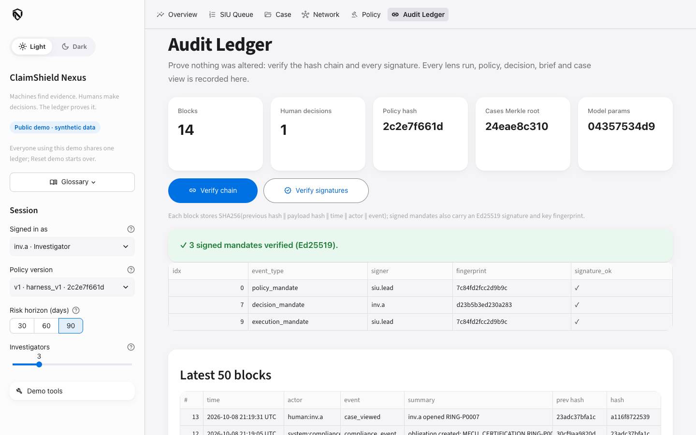<br><sub><b>Audit Ledger</b> — SHA-256 hash chain plus Ed25519 signature verification of every mandate.</sub></td>
  </tr>
  <tr>
    <td><br><sub><b>Light</b> — Overview.</sub></td>
    <td>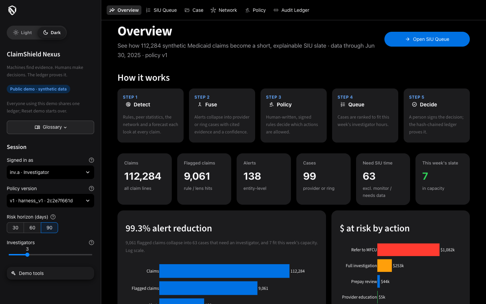<br><sub><b>Dark</b> — Overview.</sub></td>
  </tr>
  <tr>
    <td>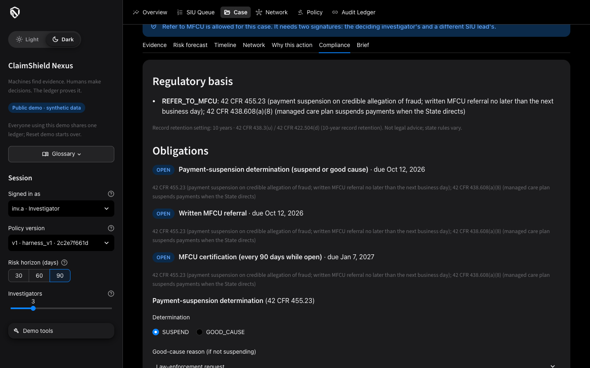<br><sub><b>Dark</b> — ring case, Compliance tab.</sub></td>
    <td>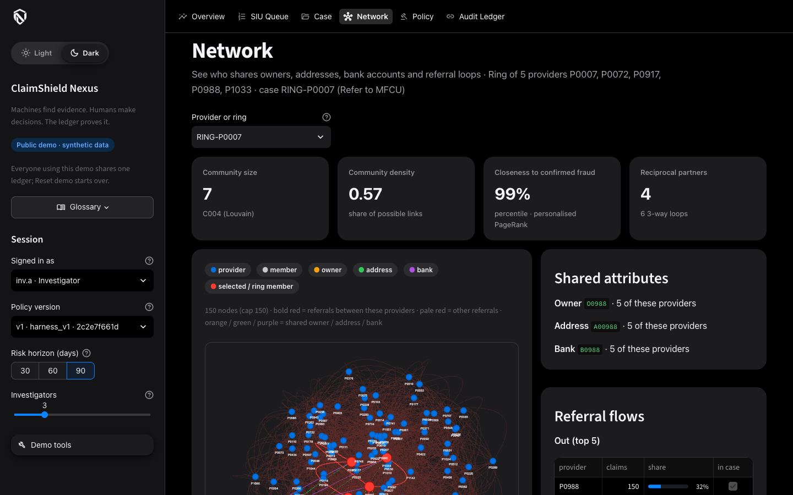<br><sub><b>Dark</b> — Network.</sub></td>
  </tr>
  <tr>
    <td colspan="2">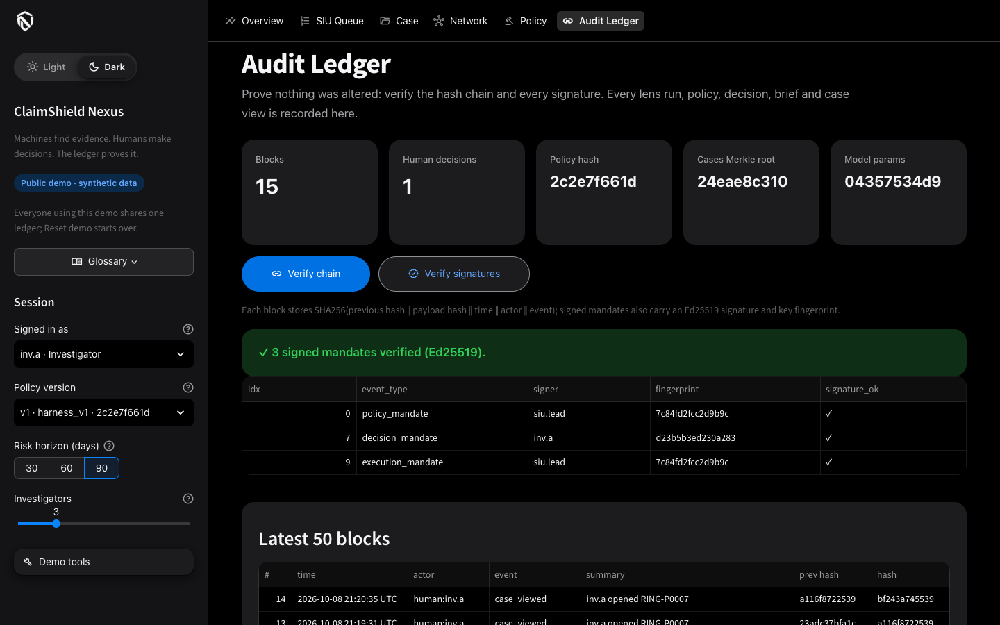<br><sub><b>Dark</b> — Audit Ledger after Verify signatures.</sub></td>
  </tr>
</table>

## System design

Full design notes: [ARCHITECTURE.md](ARCHITECTURE.md).

### Architecture

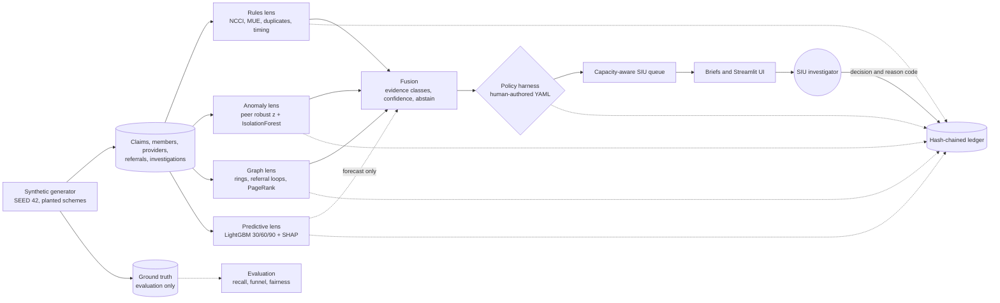

### Decision sequence

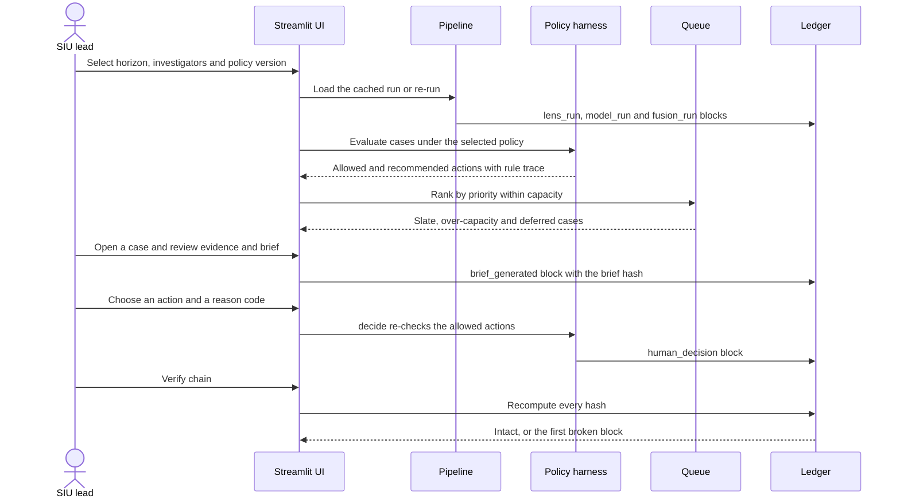

### Decision harness

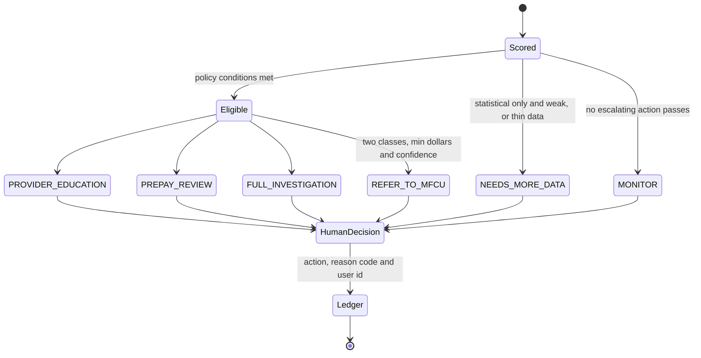

### Data model

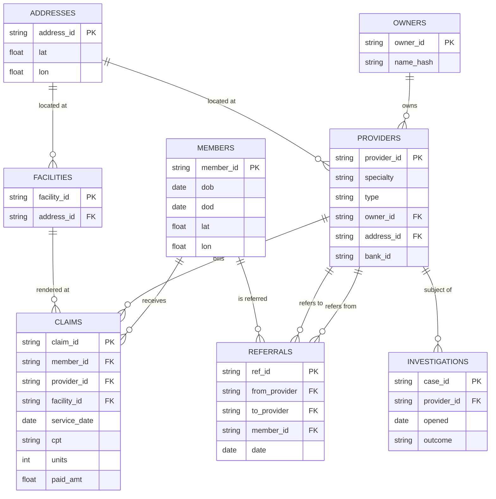

## Detection lenses

| Lens | Method | Evidence class | Catches |
|---|---|---|---|
| Rules | Seven deterministic edits: duplicates, NCCI unbundling, MUE units, more than 24 h billed per day, service after death, geo-impossible same day, excluded provider | Deterministic | Duplicate billing, unbundling, excessive units, impossible timing, phantom services |
| Anomaly | Peer-group robust z-scores (specialty + type) on E/M mix, units, paid per member-month, claims per day and new-member share, adjusted for each provider's own baseline; IsolationForest | Statistical | Upcoding, volume spikes |
| Graph | Shared owner/address/bank, referral loops and concentration, member overlap, Louvain communities, personalized PageRank seeded from confirmed cases | Structural | DME rings, kickback referrals |
| Predictive | LightGBM per horizon on provider × month snapshots, isotonic calibration, SHAP drivers, embargoed time split | Forecast, never evidence | Early warning for providers without flag history |

## Signed mandates (AP2-inspired)

Inspired by agent-payment mandates (Google AP2) and agentic-UPI safeguards: signed intent, signed approval, default-deny automation, tamper-evident logs.

| Mandate | Signed by | Bound to | Effect |
|---|---|---|---|
| Policy (intent) | SIU lead | Policy version and hash, dual-control and automation scope | Without a valid one, `decide()` refuses every action ("Policy not authorised") |
| Decision (cart) | Deciding investigator or lead | Case hash, evidence hash, policy hash, action, reason code | Executes, or waits as PENDING_APPROVAL for dual-control actions |
| Execution (approval) | A different SIU lead (four-eyes) | Decision mandate hash | Executes REFER_TO_MFCU and creates its compliance obligations |
| Revocation | SIU lead | Target mandate hash | Cancels a pending decision or a policy version |

Automation is default-deny: the system actor may only route MONITOR / NEEDS_MORE_DATA. Mandates are canonical JSON → SHA-256 → Ed25519; demo keys live in `data/out/keys/` (production: SSO identities with HSM/KMS-held keys).

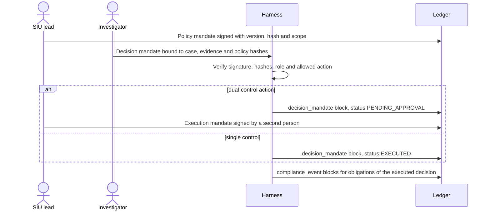

## Compliance (US payer)

Obligations come only from human, executed decisions, never from model scores. Full map with where each item is implemented and tested: [docs/COMPLIANCE.md](docs/COMPLIANCE.md). Not legal advice; citations for orientation; state rules vary.

| Obligation or control | Trigger | Due | Basis |
|---|---|---|---|
| Payment-suspension determination (suspend or documented good cause) | REFER_TO_MFCU executed | Next business day | 42 CFR 455.23 |
| Written MFCU referral | REFER_TO_MFCU executed | Next business day (weekends skipped) | 42 CFR 455.23 |
| MFCU certification | REFER_TO_MFCU executed | Every 90 days while open | 42 CFR 455.23 |
| Report and return an overpayment | Reason OVERPAYMENT_IDENTIFIED | 60 days; 180-day good-faith pause only for Medicare A/B | 42 U.S.C. 1320a-7k(d); 42 CFR 401.305 |
| Minimum necessary | Every table and brief | Member tokens, age bands, 3-digit ZIP; reveal needs a reason and is ledgered | 45 CFR 164.502(b) |
| Audit controls and integrity | Every case view, reveal, decision and mandate | Hash chain + signatures | 45 CFR 164.312(b), 164.312(c)(1) |

## Results

Synthetic run, SEED 42: 112,284 claims, 1,200 providers, 18 months. Ground truth exists only because the data is synthetic, and only `eval/` reads it. Full generated tables are in [docs/RESULTS.md](docs/RESULTS.md); code review findings are in [docs/REVIEW.md](docs/REVIEW.md).

**Alert collapse: 99.3% reduction.** 112,284 claims → 9,061 flagged claims → 138 alerts → 99 cases → 63 need investigator time → 7 fit this week (3 investigators).

| Planted scheme | Entities | Any case | PREPAY review or higher |
|---|---|---|---|
| Duplicate billing | 8 | 100% | 100% |
| Unbundling | 8 | 100% | 100% |
| Phantom services | 6 | 100% | 100% |
| Impossible timing | 6 | 100% | 100% |
| DME ring | 10 | 100% | 100% |
| Kickback referral | 9 | 100% | 100% |
| Excessive units | 8 | 100% | 88% |
| Upcoding | 10 | 80% | 10% (50% after the policy demo) |

**Legitimate outliers:** 4 high-cost oncology and 3 busy ER providers never get an escalating action (2 abstain, 5 have no case). All 15 honest one-off billing slips get `PROVIDER_EDUCATION`. **Zero** clean providers need investigator time.

| Investigators | In capacity | Over capacity (escalate) | Deferred | MFCU in / over | Weeks to clear |
|---|---|---|---|---|---|
| 1 | 4 | 14 | 45 | 1 / 8 | 17.1 |
| 3 | 7 | 9 | 47 | 6 / 3 | 5.7 |
| 5 | 13 | 5 | 45 | 9 / 0 | 3.4 |

**Forecast vs naive persistence baseline** (embargoed test split, T ≥ 2025-01; baseline = strong flag in the last 90 days):

| Horizon | ROC-AUC model / baseline | PR-AUC model / baseline | New-onset ROC-AUC model / baseline (positives) |
|---|---|---|---|
| 30 days | 0.988 / 0.986 | 0.867 / 0.952 | 0.795 / 0.5 (6) |
| 60 days | 0.980 / 0.967 | 0.894 / 0.931 | 0.849 / 0.5 (14) |
| 90 days | 0.951 / 0.954 | 0.782 / 0.911 | 0.638 / 0.5 (15) |

**Timings** (MacBook Air M3): generator about 1 s, full pipeline 8–15 s, page loads 0.1–0.5 s warm, 186 tests in about 30 s.

## Responsible AI

- **Human in the loop.** Code only outputs `allowed_actions` and a `recommended_action`. A final action is written only by `decide()`, with a human user id and reason code, after re-checking the policy.
- **Fail-safe abstain.** Statistical-only evidence below threshold, or thin data, becomes `NEEDS_MORE_DATA`. The brief then lists what would change it (medical records sample, member verification calls, ownership documents). Missing data lowers confidence, never raises it.
- **Evidence citations.** Every suspicion cites claim id, field, value, expected value or threshold, and source lens. Forecast drivers are shown in plain English.
- **Fairness check.** Flag rates by provider type and specialty, overall and for clean providers only (0.0% in every group). Peer groups are specialty + type, so no specialty is judged against another.
- **Audit ledger.** Every lens run, model run, policy change, signed mandate, brief, case view, PHI reveal and compliance event is hash-chained. Editing any block breaks verification at that block, and a tampered signed block also fails its signature check.
- **Why not blockchain.** Claims data is PHI under HIPAA: it should not be replicated to outside parties, and immutable shared storage conflicts with correction and retention duties. A permissioned chain mainly adds consortium overhead to what is a single-organisation audit trail. The property that matters is tamper evidence, which a SHA-256 hash chain in the payer's own database provides. The ledger stores ids, scores and hashes, not claim lines.

## Honest limitations

- **Synthetic data.** Schemes are planted and the base data is clean, so rules look near-perfect. Real claims will be noisier, and no PHI controls were needed or built.
- **Predictive vs baseline.** On already-flagged providers a naive persistence baseline is as good or better (it wins PR-AUC on every horizon). The forecast is an early warning for providers without flag history, rests on few positives, and never counts as evidence. Train/test leakage was found and fixed with an embargo; the numbers above are post-fix.
- **Label hindsight.** Forecast labels use whole-run alert scores rather than re-scoring each snapshot.
- **Upcoding recall.** Upcoding is visible only to peer comparison, so most upcoders abstain under the default policy (10% at PREPAY or higher). A human can lower the E/M thresholds on the Policy page: 1 → 5 upcoders, still zero clean providers.
- **Capacity assumptions.** Estimated hours per action and 30 hours per investigator per week are policy assumptions, not measured SIU throughput. Adding investigators can move a small backfill case off the slate when a higher-priority must-take case now fits; it stays listed as deferred.

## Quickstart

macOS needs OpenMP for LightGBM:

```bash
brew install libomp
python3.11 -m venv .venv
.venv/bin/pip install -r requirements.txt
./run.sh            # generate data → run the pipeline with a fresh ledger → open the app at http://localhost:8501
```

Step by step:

```bash
.venv/bin/python -m data.gen.synth                 # synthetic data (about 1 s)
.venv/bin/python -m core.pipeline --reset-ledger   # lenses, models, fusion, harness (about 10 s)
.venv/bin/streamlit run ui/app.py
```

**Running tests**

```bash
.venv/bin/python -m pytest -q                      # 186 tests
.venv/bin/python -m eval.pipeline_check            # policy invariants and recall (read-only)
.venv/bin/python -m eval.report                    # regenerates docs/RESULTS.md
```

**Demo walkthrough:** a timed 4-minute script with exact clicks is in [DEMO.md](DEMO.md).

## Project structure

```
claimshield/
├── core/          # lenses, fusion, policy harness, signed mandates, compliance, PHI controls, queue, briefs, ledger, pipeline (never reads ground truth)
├── data/gen/      # seeded synthetic generator, planted schemes, legitimate outliers
├── eval/          # recall, fairness, model vs baseline, exit checks, results report (only place ground truth is read)
├── policy/        # human-authored decision policy versions (harness_v1.yaml)
├── public/        # logos: Black_logo.png (light mode), White_logo.png (dark mode)
├── ui/            # Streamlit app, design system (style.py) and the six views
├── tests/         # pytest and Streamlit AppTest suites
├── docs/          # RESULTS.md, REVIEW.md, COMPLIANCE.md, screenshots
├── ARCHITECTURE.md
├── DEMO.md
├── requirements.txt
└── run.sh
```

## Roadmap

- Re-score alerts for each snapshot to remove label hindsight, and learn precision from investigator verdicts recorded in the ledger.
- A FastAPI wrapper over `core/` so case-management systems can pull cases and push decisions.
- A pilot on de-identified claims with PHI controls, plus drift monitoring of flag rates per peer group.
- Role-based access and signed ledger exports for external auditors.

## Acknowledgements

- Problem statement: the Acentra Health hackathon (healthcare payer fraud, waste and abuse).
- Claim edits follow public CMS concepts, the National Correct Coding Initiative (NCCI) procedure-to-procedure edits and Medically Unlikely Edits (MUE), implemented on small synthetic code tables.
