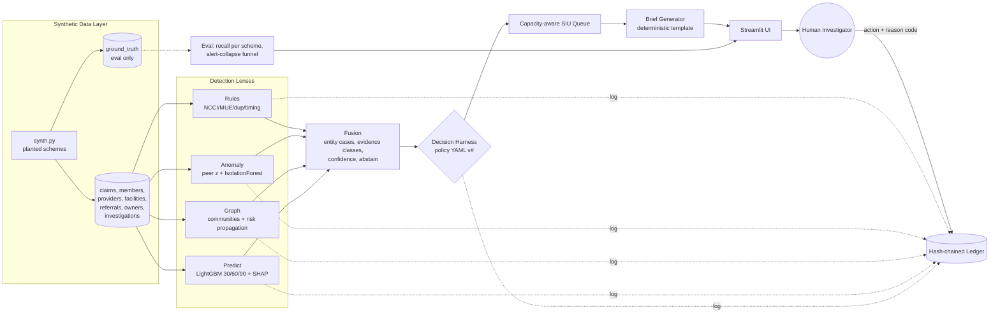

# ClaimShield Nexus

> Machines find evidence. Humans make decisions. The ledger proves it.

## The problem

Medicaid program-integrity teams receive far more fraud, waste and abuse (FWA) signals than their Special Investigations Unit (SIU) can work. Rule engines flag thousands of claim lines, statistical models produce opaque scores, and an investigator has to piece together why a provider is suspicious, how much is at stake, and whether the evidence would hold up. ClaimShield Nexus turns raw claims into a short, capacity-ranked list of cases. Each case comes with cited evidence, an honest confidence score, its limitations and the actions policy allows. A human still makes every final call, and every step is written to a tamper-evident audit log.

## What makes it different

- **Four independent lenses.** Deterministic rules (NCCI, MUE, duplicates, impossible timing, deceased or distant members), peer-group statistics (robust z-scores + IsolationForest), an entity graph (shared owner/address/bank, referral loops, Louvain communities, risk propagation) and a 30/60/90-day LightGBM forecast with SHAP drivers. Independence is counted by evidence class, not by number of alerts.
- **Human-authored policy harness.** Models only propose. A versioned YAML policy decides which actions are allowed. Weak or single-statistic evidence abstains to `NEEDS_MORE_DATA`, and `REFER_TO_MFCU` needs two evidence classes, minimum dollars and confidence, plus a human. Policy edits are previewed in memory and saved as new hashed versions.
- **Capacity-aware queue.** `priority = P(escalation) × $ at risk × severity × member harm ÷ estimated hours`. The queue fills real investigator hours, must-take cases go first, and overflow is shown as deferred or over-capacity, never dropped.
- **Tamper-evident ledger.** Every lens run, model run, policy version, generated brief and human decision is appended to a SHA-256 hash chain in SQLite. Verify finds the first broken block.

## Architecture

Full design: [ARCHITECTURE.md](ARCHITECTURE.md).



No LLM or external AI API is used anywhere. Investigation briefs are deterministic templates filled from case data.

## How to run

Python 3.11. macOS needs `brew install libomp` for LightGBM.

```bash
python3.11 -m venv .venv && .venv/bin/pip install -r requirements.txt
./run.sh                       # generate data -> run pipeline (fresh ledger) -> launch Streamlit
```

Step by step:

```bash
.venv/bin/python -m data.gen.synth                 # synthetic data, about 2 s
.venv/bin/python -m core.pipeline --reset-ledger   # all lenses, models, fusion, harness, about 15 s
.venv/bin/python -m pytest -q                      # 68 tests
.venv/bin/python -m eval.report                    # regenerates docs/RESULTS.md
.venv/bin/streamlit run ui/app.py
```

Pages: **Overview** (funnel, validation, fairness, model vs baseline) · **SIU Queue** · **Case** (evidence, forecast, timeline, network, rule trace, brief, decision form) · **Network** · **Policy** · **Audit Ledger**.

## Results

Full, generated numbers: [docs/RESULTS.md](docs/RESULTS.md). Highlights from the synthetic run (SEED=42, 112k claims, 1,200 providers, 18 months):

- **99.3% alert reduction:** 9,061 flagged claims become 63 cases that need investigator time, and 7 of them fit this week's capacity at 3 investigators.
- **Recall at PREPAY_REVIEW or higher:** 100% for duplicate billing, unbundling, phantom services, impossible timing, DME rings and kickback referrals; 88% for excessive units; 10% for upcoding (any-case recall 80%).
- **Zero** clean providers and **zero** legitimate outliers (high-cost oncology, busy ERs, honest billing slips) reach FULL_INVESTIGATION or MFCU.
- **Forecast vs naive persistence baseline (ROC-AUC, h = 90):** .951 vs .954. On providers with no flag history the model reaches .64–.85 where the baseline is blind (.50), but on few positives.

## Responsible AI

- **Human in the loop:** code outputs only `allowed_actions` and a `recommended_action`. The final action is written only by `decide()`, with a human user id and a reason code.
- **Abstain by default:** statistical-only or low-completeness cases become `NEEDS_MORE_DATA`. The brief then lists the evidence that would change that (medical records sample, member verification calls, ownership documents).
- **Evidence citations:** every suspicion cites claim id, field, value, expected value or threshold, and source lens. SHAP drivers are shown in plain English.
- **Fairness check:** flag rates by provider type and specialty, overall and for clean providers only. Peer groups are specialty + type.
- **Audit:** lens runs, model runs, policy changes, briefs and decisions are hash-chained. Tampering is detectable.

## Honest limitations

- **Synthetic data only.** Schemes are planted, and rules have near-perfect precision because the base data is clean. Real claims will be noisier. No PHI is handled, so no PHI controls were needed or built.
- **Predictive vs baseline.** On already-flagged providers a persistence baseline is as good or better (it wins PR-AUC and P@20 on every horizon). The forecast is positioned as an early warning for new-onset providers, and it is never counted as evidence.
- **Label hindsight.** Forecast labels use whole-run alert scores (not re-scored per snapshot), so labels carry mild hindsight. Train, calibration and test are separated by an embargo.
- **Upcoding recall.** Upcoding is visible only to peer comparison, so most upcoders abstain under the default policy. A human can lower the E/M-share thresholds on the Policy page (1 → 5 upcoders at PREPAY+, zero clean providers).
- **Capacity assumptions.** Estimated hours per action and 30 h per investigator per week are policy assumptions, not measured SIU throughput.

## Roadmap

- Re-score alerts per snapshot to remove label hindsight, and learn precision from investigator verdicts recorded in the ledger.
- A FastAPI wrapper over `core/` so case management systems can pull cases and push decisions.
- Pilot on de-identified real claims with PHI controls, plus drift monitoring on flag rates per peer group.

## Screenshots

| Overview | Queue | Case brief |
|---|---|---|
|  |  |  |

| Network | Policy preview | Ledger verify |
|---|---|---|
|  |  |  |
